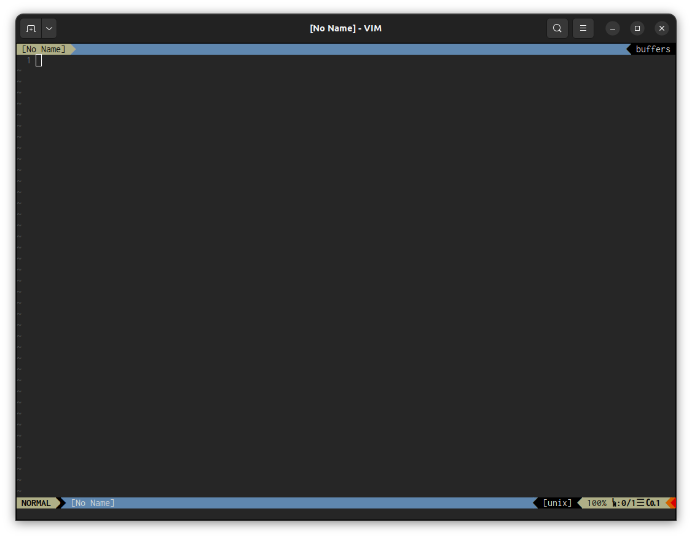

# My VIM Config



VIM merupakan Text Editor yang unopinionated, sehingga penggunanya dapat mengatur sendiri berdasarkan kebutuhan

## Instalation

1. Clone

        git clone https://github.com/yogaprttama/vimrc.git

2. Install VIM Plug

```sh
curl -fLo ~/.vim/autoload/plug.vim --create-dirs \
    https://raw.githubusercontent.com/junegunn/vim-plug/master/plug.vim
```

3. Buka VIM lalu ketik perintah `:PlugInstall`

## Fonts

Font yang sering saya gunakan pada VIM ada 2 yaitu:

* [Menlo for Powerline](https://github.com/lxbrtsch/Menlo-for-Powerline)
* [Inconsolata for Powerline](https://github.com/powerline/fonts)

## Plugins

Beberapa plugin yang saya rekomendasikan untuk development

* [vim-plug](https://github.com/junegunn/vim-plug): VIM Plugin manager
* [vim-polyglot](https://github.com/sheerun/vim-polyglot): Syntax highlighting plugin
* [emmet-vim](https://github.com/mattn/emmet-vim): Emmet autocomplete untuk HTML & CSS
* [vim-jsx-pretty](https://github.com/MaxMEllon/vim-jsx-pretty): JSX & TSX syntax highlighting
* [nerdtree](https://github.com/preservim/nerdtree): VIM File explorer
* [gruvbox](https://github.com/morhetz/gruvbox): Color scheme
* [vim-airline](https://github.com/vim-airline/vim-airline): Statusline yg berada di layar bawah VIM
* [vim-airline-themes](https://github.com/vim-airline/vim-airline-themes): VIM Airline theme

## Key Mappings

Ada beberapa perubahan yang saya lakukan pada Key Mapping VIM

jj untuk keluar dari mode INSERT, default(`Esc`):

        imap jj <Esc>

`<Ctrl>+n` untuk membuka File Explorer:

        map <C-n> :NERDTreeToggle<CR>

`:` untuk memasukan perintah, default(`;`):

        map ; :

## Penutup

Terimakasih sudah mampir, semoga bermanfaat :)
